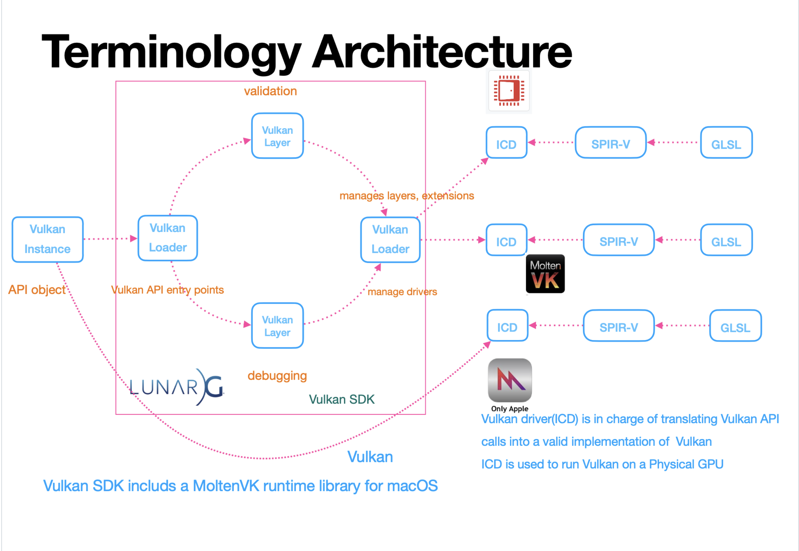
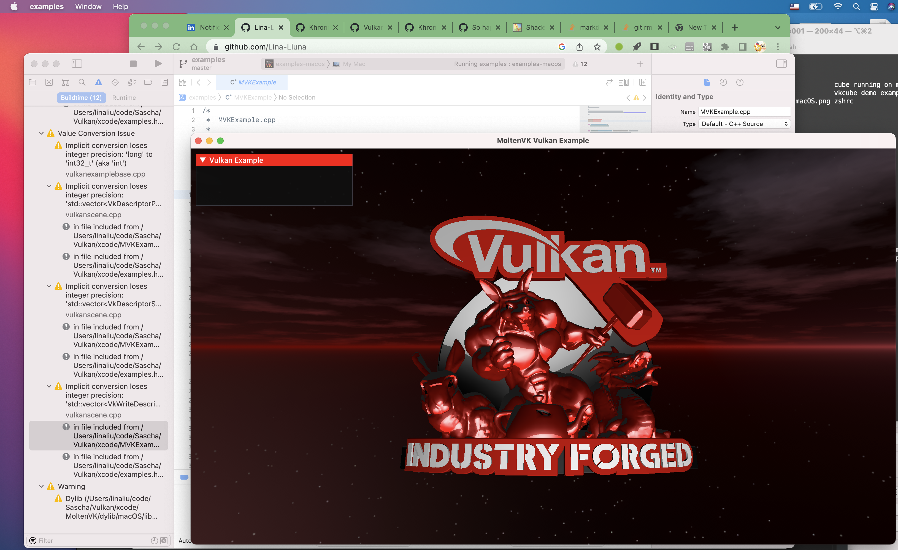
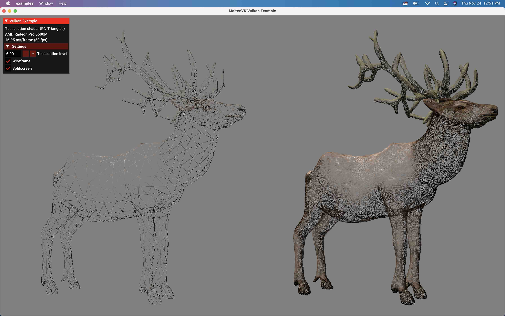
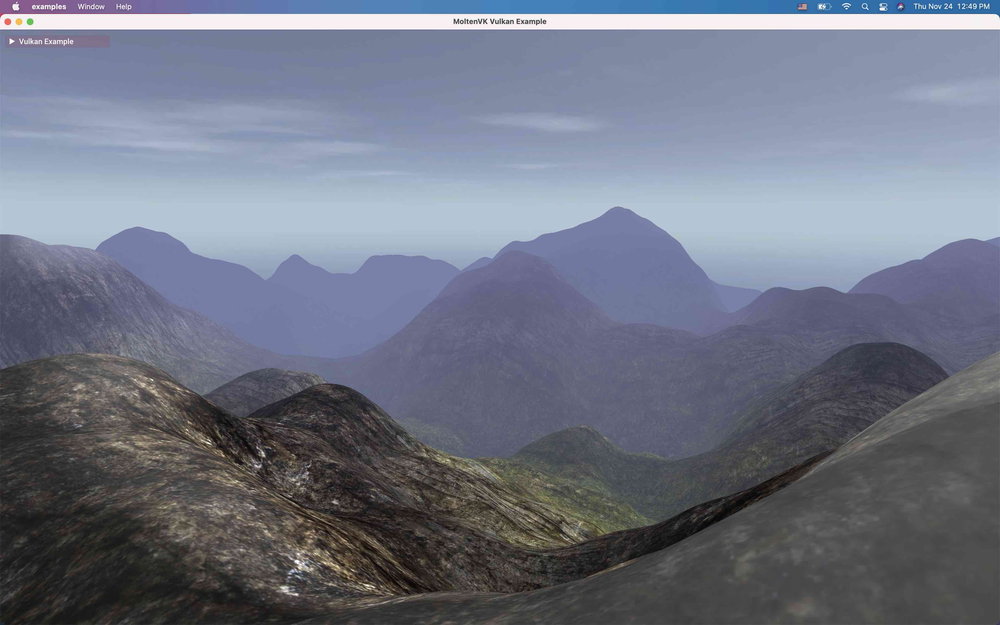
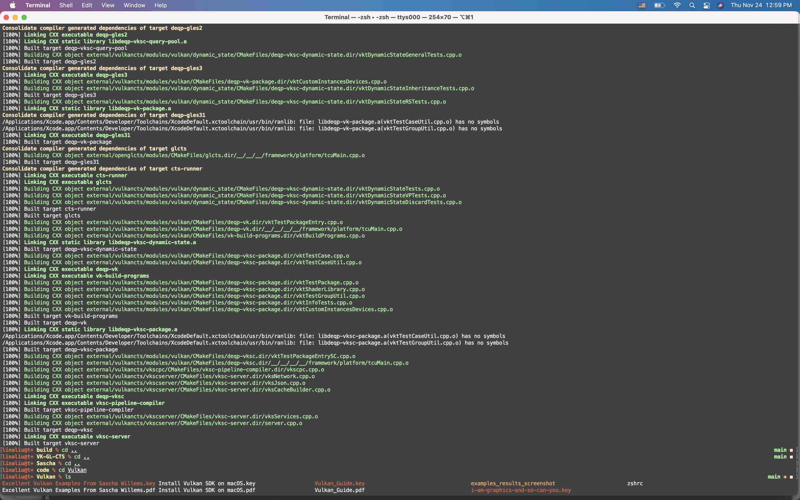
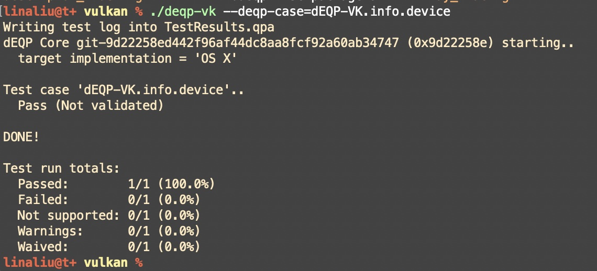

= Vulkan

== Vulkan Terminology Architecture

Video games like Anime and Manga Games, it's more exciting to get the technical knowledge about how to implement these games through graphics

== How to run Vulkan-Tools(cube/VulkanInfo)on macOS?
[options="compact"]
  * Download latest VulkanSDK for macOS from https://vulkan.lunarg.com/sdk/home#mac
  * Install
  * Download VulkanTools from https://github.com/LunarG/VulkanTools
  * git clone --recurse-submodules git@github.com:LunarG/VulkanTools.git
    ** cd VulkanTools
    ** mkdir build
    ** ./update_external_sources.sh
    ** cd build
    ** ../scripts/update_deps.py
    ** cmake -C helper.cmake ..
    ** cmake --build . --parallel

  * Download Vulkan-Tools from https://github.com/KhronosGroup/Vulkan-Tools

  * error happened, running .sh errors is because you need set environment in ./bash_profile
  * cmake error happened, need set some C++ compile environment in ./zshrc
  * run ./cube to validate your vulkan environment

== How to run Excellent Vulkan Examples from git@github.com:SaschaWillems/Vulkan.git:
  * git clone
  * git submodule init
  * git submodule update
  * python download_assets.py
  * git clone git@github.com:KhronosGroup/MoltenVK.git
  * cd MoltenVK
  * ./fetchDependencies --macos
  * make macos
  * cd xcode
  * prepare to copy MoltenVK which contained dylib to vulkan examples
  * cd macos
  * rm MoltenVK
  * ln -s /Users/linaliu/code/Sascha/MoltenVK/MoltenVK
  * open xcode project, press run
  * Amazing demo come out!

== How to run Vulkan-CTS on macOS?
=== run Vulkan Comformance Test Suite to validate the application new features.
  * git clone git@github.com:KhronosGroup/VK-GL-CTS.git
  * python3 external/fetch_sources.py to download sources for zlib, libpng, jsoncpp, glslang, vulkan-docs, spirv-headers, and spirv-tools.
  * python3 -m pip install lxml to install lxml
  * mkdir build
  * cd build
  * cmake .. -DCMAKE_BUILD_TYPE=Debug -DDEQP_TARGET=osx -DCMAKE_C_FLAGS=-m64 -DCMAKE_CXX_FLAGS=-m64
  * make -j4, why not just make -j, because you compute may godie!!
  * build done!
  * Run automatically: python3 /Users/linaliu/code/Sascha/VK-GL-CTS/external/vulkancts/scripts/build_mustpass.py
  * cd /Users/linaliu/code/Sascha/VK-GL-CTS/
  * cd /Users/linaliu/code/Sascha/VK-GL-CTS/build/external/vulkancts/modules/vulkan/
  * Run single Vulkan-CTS test case: ./deqp-vk --deqp-case=dEQP-VK.info.device

