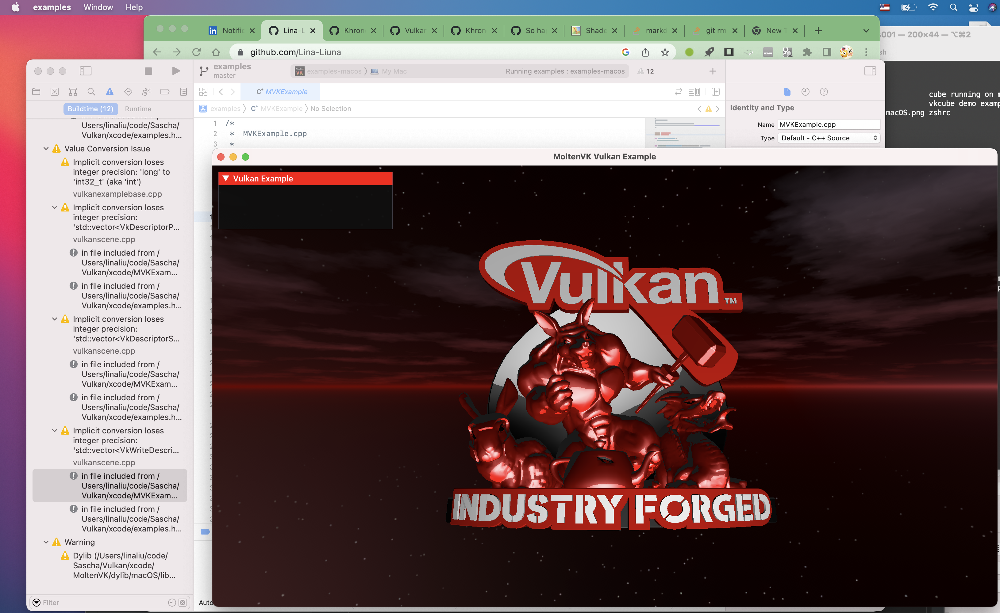

# Vulkan

2. Download latest VulkanSDK for macOS from https://vulkan.lunarg.com/sdk/home#mac
3. Install
4. Download VulkanTools from https://github.com/LunarG/VulkanTools
5.     git clone --recurse-submodules git@github.com:LunarG/VulkanTools.git
    cd VulkanTools
    mkdir build
    ./update_external_sources.sh
    cd build
    ../scripts/update_deps.py
    cmake -C helper.cmake ..
    cmake --build . --parallel

6. Download Vulkan-Tools from https://github.com/KhronosGroup/Vulkan-Tools

7. error happened, running .sh errors is because you need set environment in ./bash_profile
8. cmake error happened, need set some C++ compile environment in ./zshrc
9. run ./cube to validate your vulkan environment

